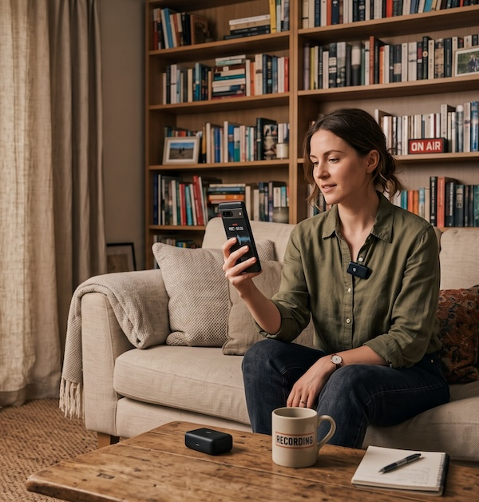

 

# Choose a Great Recording Spot 

Good audio recordings start long before you press the record button. The room you choose and where you clip the microphone make a bigger difference to sound quality than almost anything else, and fortunately both are quick and easy to get right. This activity walks you through picking a quiet, "soft" recording space for you to record your audio in.

## Part A: Selecting a Suitable Recording Location

Step 1
{: .label .label-step}
- Start by listening. Stand in the room you are considering, close your eyes, and stay quiet for 30 seconds. Notice every sound: fans, fridges, ventilation, traffic, hallway chatter, and hum from lights or computers. Anything you can hear now, your microphone will hear even more clearly.
- If you can, turn off or unplug the noisy things you have control over: ceiling fans, space heaters, air purifiers, desk fans, and noisy laptops. Close windows and doors.
- Ask anyone nearby to keep the volume down for the next while, and put a "Recording in progress, please knock quietly" note on the door if you have one handy. 
{: .step}

Step 2
{: .label .label-step}

- Look at the surfaces in the room. Hard, flat surfaces like bare walls, windows, tile floors, and long tables bounce sound back at the microphone and create an echoey, "bathroom" sound. Soft surfaces absorb sound and make voices sound warm and close.
- Ideal rooms have carpet or rugs, curtains, upholstered furniture, bookshelves full of books, cushions, coats on hooks, or fabric wall hangings. A small carpeted office, a living room with a couch and curtains, or even a walk-in closet full of clothes will sound far better than a large empty meeting room with a whiteboard.
- Smaller rooms are usually better than larger ones, as long as they are not so small that you feel cramped. High ceilings and big empty spaces tend to echo. 
{: .step}

Step 3
{: .label .label-step}
- Do the clap test. Stand where the speaker will sit, clap your hands once loudly, and listen. If you hear a sharp ring or a fluttering echo that lasts more than a moment, the room is too "live." If the clap sounds dull and dies away almost instantly, you have found a good spot.
- If the room is echoey but you have no better option, improvise. Hang a blanket or two over chairs behind and beside the speaker, put a rug on the floor, or throw some coats over the table. Even a couple of pillows placed behind the laptop can help quite a bit. 
{: .step}

Step 4
{: .label .label-step}
- Set up the speaker's chair and your recording device. Have the speaker sit facing into the room (toward soft surfaces), not facing a window or a bare wall. Keep them about a metre away from any wall so their voice does not bounce straight back into the mic.
- Place your laptop or phone within easy reach but keep it a little distance from the speaker.
- Turn off notifications on the recording device so a chime does not sneak into a take. On a laptop, closing email and chat apps for the session is the simplest way to do this. 
{: .step}

## Working with community language keepers?
Before publishing recordings of any Indigenous language please remember to:
- Ask for permission to record
- Confirm who the audio recordings can be shared with (e.g. community members only, public, researchers)
- Confirm spellings
- Confirm pronunciations
- Keep the untrimmed originals archived so nothing is lost
  

[NEXT STEP: Connect the DJI Mic Mini to Your Phone](2-connect-to-phone.html){: .btn .btn-blue }
