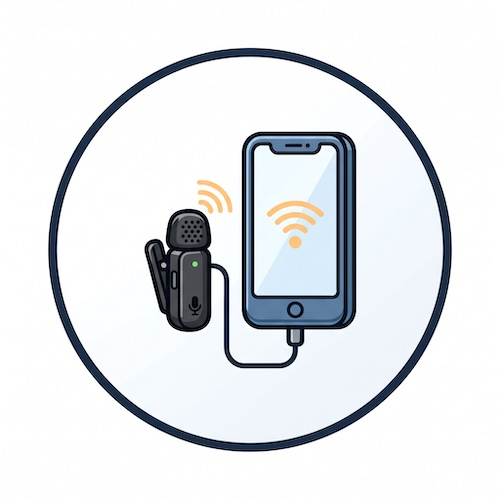
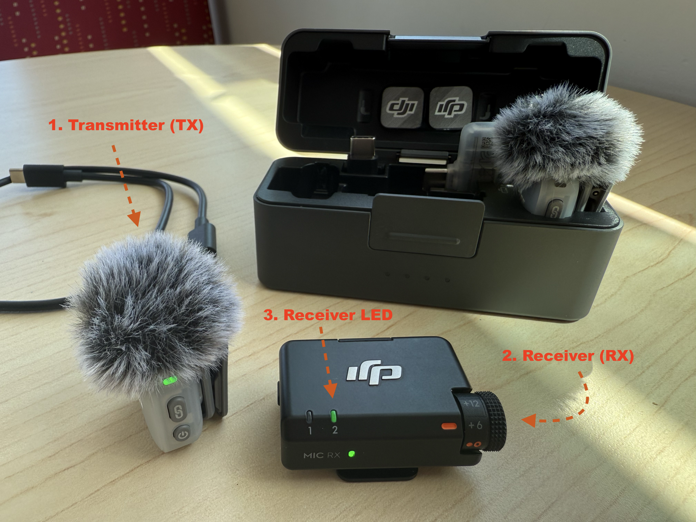
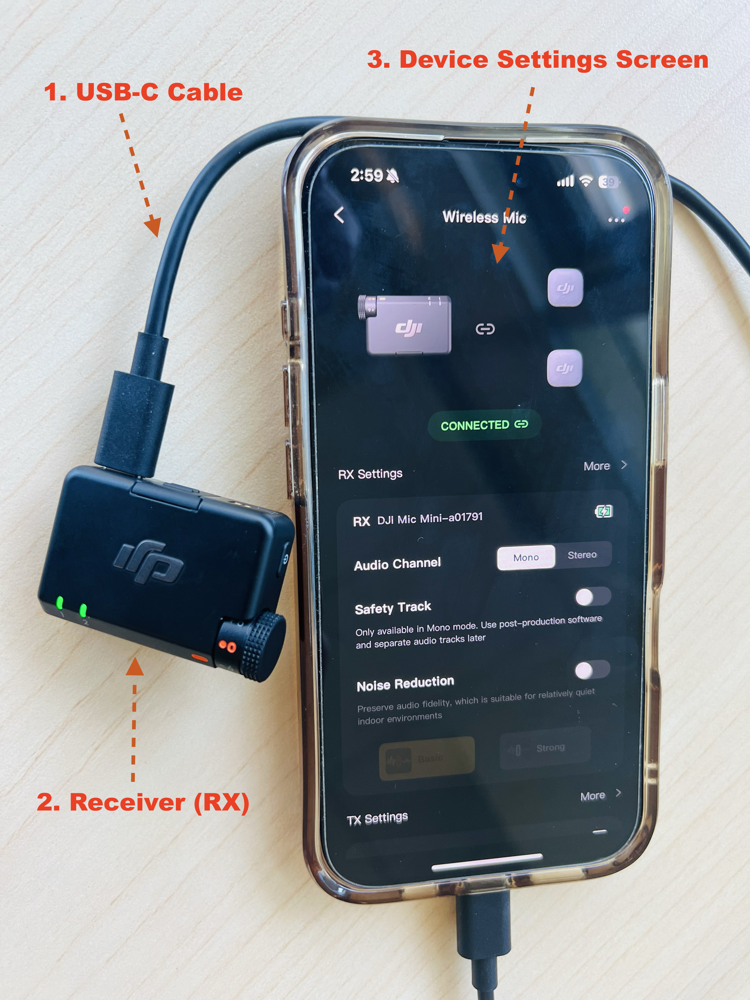
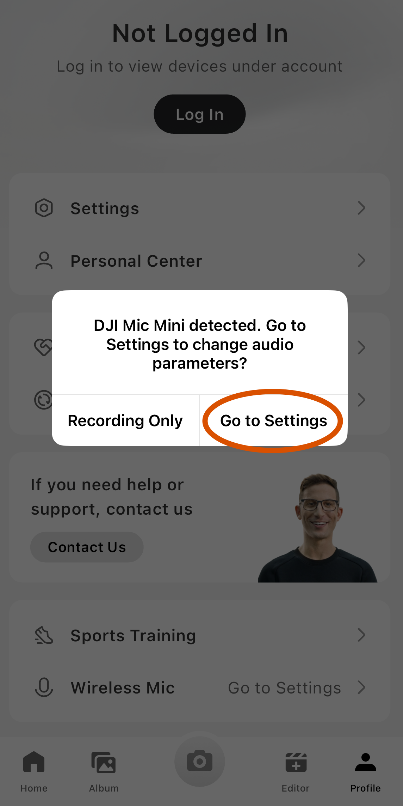
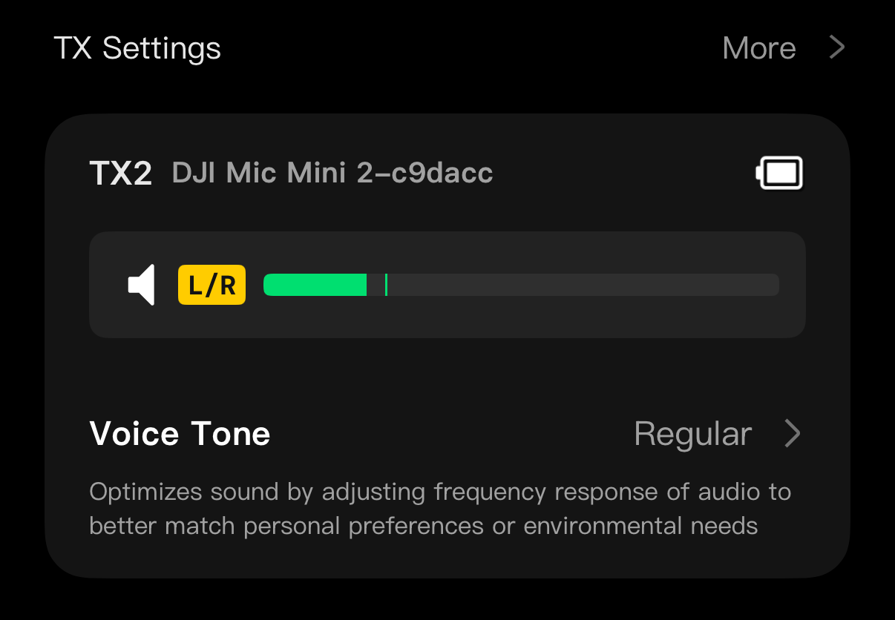
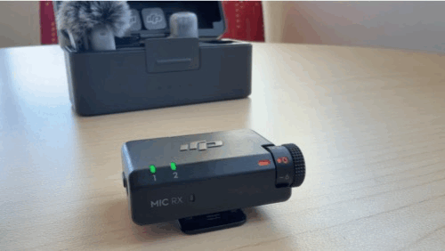

# Connect the DJI Mic Mini to Your Phone
 

## What you need to have before you start:

1. A charged DJI Mic Mini transmitter (TX) and receiver (RX)
2. An iPhone (plus the Lightning to USB-C cable if your iPhone has a Lightning port)
3. The free [DJI Mimo app](https://apps.apple.com/app/dji-mimo/id1431720653){:target="_blank"}
4. The built-in iPhone Voice Memos app
5. A quiet room
6. A digital or printed list of the alphabet you are recording

**If you get stuck, please ask your instructor for assistance or look at the Quick troubleshooting section at the bottom of this page!**

Step 1
{: .label .label-step}
- Open the charging case. The microphone transmitter (TX) and receiver (RX) **power on automatically** when you lift them out, and they come pre-linked from the factory.
- If a unit is off, **press and hold its power button for two seconds**. Check that the status LED on the receiver is **solid green**, which means the TX and RX are linked and ready.
- NOTE: Do not connect the receiver to you phone until after the receiver has connected to the microphone transmitter.
{: .step}

 
{: .step}

Step 2
{: .label .label-step}

- Make sure both the DJI Mic Mini receiver and microphone are turned on **before** plugging in your iPhone.
- Connect the DJI Mic Mini receiver to your phone by plugging the USB-C cable directly into the **charging port on the bottom of your iPhone**, and then to the receiver itself (NOTE: On an iPhone with a Lightning port, use a lighting to USB-C cable and attach the  receiver first). 
- Once connected, your phone treats the receiver as an **external microphone**, so apps like Voice Memos use it automatically instead of the built-in mic.
- The green LED below the 1 or 2 on the receiver confirms it is linked to the microphone transmitter.
{: .step}

Step 3
{: .label .label-step}

- Clip the microphone transmitter to the speaker's collar or shirt, about **15 to 20 cm (a hand-span) below their chin**, with the mic capsule pointing up toward their mouth.
- Attach the furry windscreen if you are anywhere near a fan, vent, or open window, and keep the transmitter clear of jewelry, lanyards, zippers, and hair that could brush against it between letters.
- **Noise cancelling:** pressing the microphone transmitter's power button once toggles noise cancelling, and the TX LED turns solid yellow when it is on. In a quiet room, leave it **off** for the most natural vowel and consonant sounds. Only use it if you cannot avoid steady background noise like a ventilation hum.

{: .step}

Step 4
{: .label .label-step}

- With the receiver plugged in, open the **DJI Mimo** app on your iPhone. The first time you connect, allow any permission prompts and let the app finish a firmware update if one is offered.
- Once the receiver is connected, a pop-up will appear saying "DJI Mic Mini detected." Tap **Go to Settings** to open the device page.
- On the device page, you'll see the connected transmitter, its battery level, and a live audio level meter.
- You will only use Mimo to **check levels**. NOTE: The actual recording happens in the next activity.
{: .step}

Step 5
{: .label .label-step}

- Gain is how strongly the receiver amplifies the microphone signal. Set it once, properly, and every letter you record afterwards will be at a healthy volume. 
- On the Mimo device page, find the green **live level meter**, which moves as the speaker talks. Have the speaker say a few practice letters **at the exact volume and distance they will use for the real recording**, including the loudest letters, since open vowels like "A" tend to peak highest.
- Watch where the meter peaks, then turn the **physical gain dial** on the receiver until the loudest letters peak at roughly **two-thirds to three-quarters of the meter**. Peaks should **never hit the red zone**, which means clipping and permanent distortion.

- **Too hot vs. too quiet:** a slightly quiet recording can be boosted later with no harm, but a clipped (red-lined) recording is ruined and cannot be fixed. When in doubt, aim a little low.
{: .step}

**Note on headphone monitoring:** the Mic Mini receiver has no headphone jack, so you monitor visually with the Mimo meter, then confirm by ear with the playback test in Step 6. If you need live headphone monitoring for future projects, that feature is on DJI's Mic Mini kits.

[NEXT STEP: Record Short Audio Clips](2-audo-record.html){: .btn .btn-blue }
