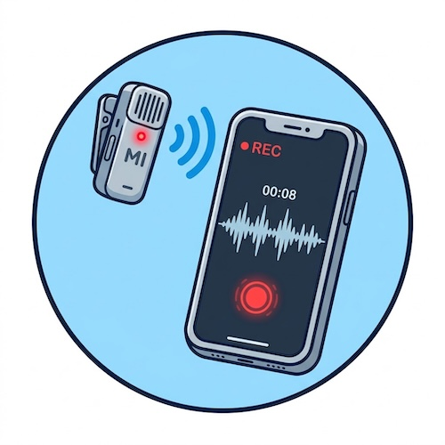

# Record Short Audio Clips on your iPhone
 

Let's record some short audio clips, just one word or letter sound per audio clip. 

**If you get stuck or having any qursion, please ask your instructor for assistance!**

Step 1
{: .label .label-step}
- Open the charging case. The microphone transmitter (TX) and receiver (RX) **power on automatically** when you lift them out, and they come pre-linked from the factory.
- If a unit is off, **press and hold its power button for two seconds**. Check that the status LED on the receiver is **solid green**, which means the TX and RX are linked and ready.
- NOTE: Do not connect the receiver to you phone until after the receiver has connected to the microphone transmitter.
{: .step}

 
{: .step}
