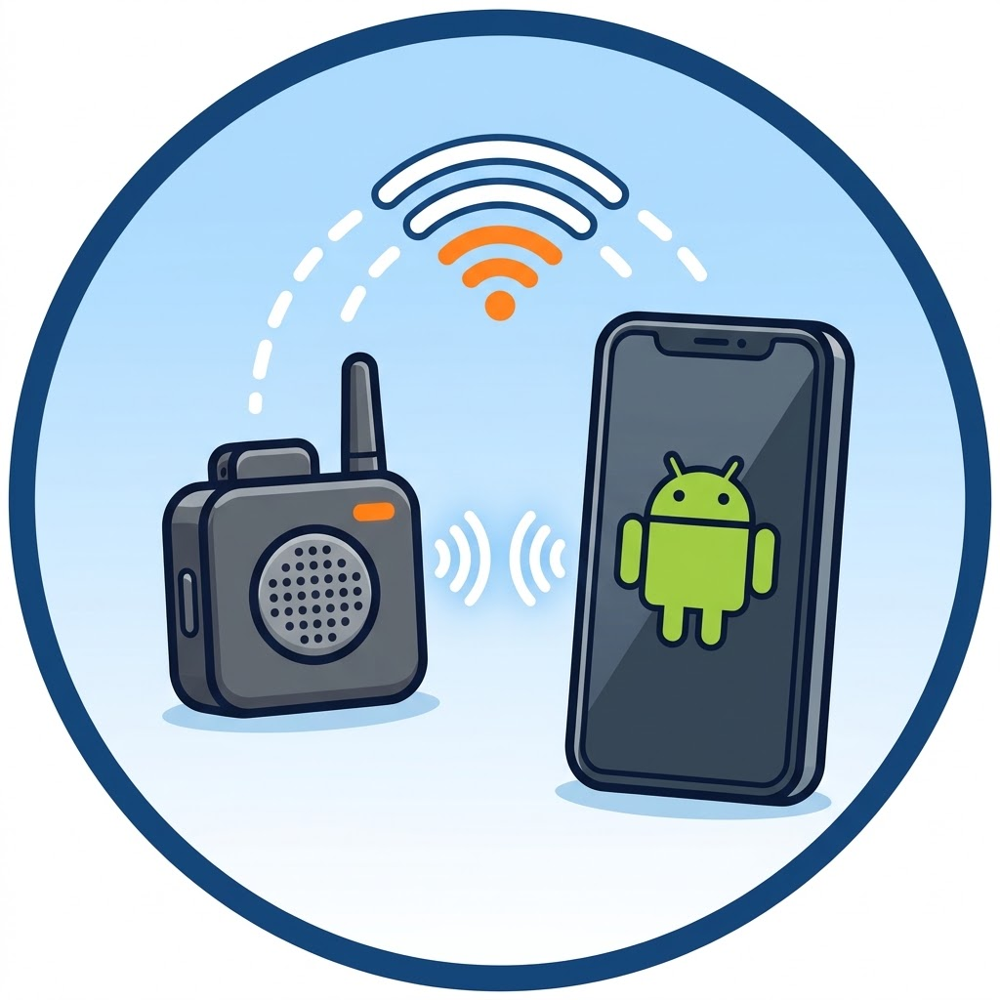
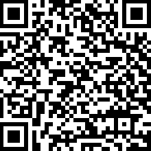
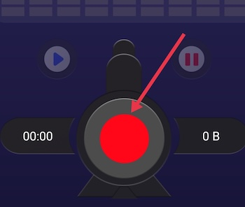
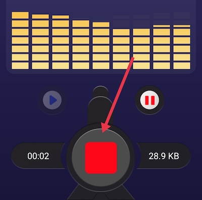
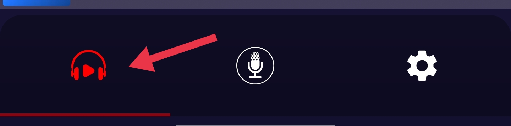
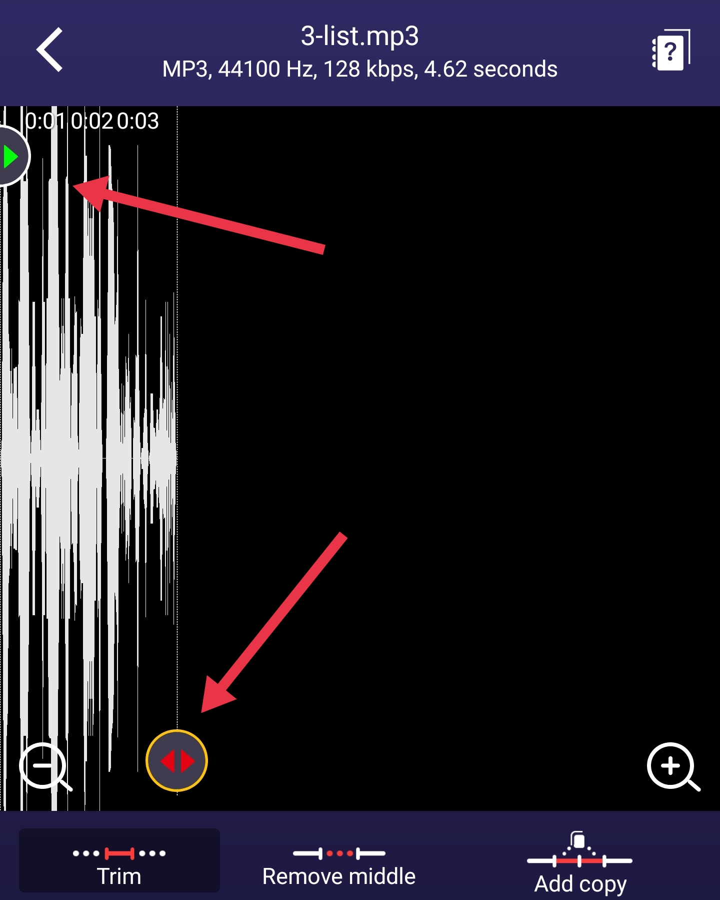
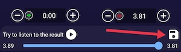

  
# Record Short Audio Clips on your Android Phone

Let’s record some short audio clips, just one word or letter sound per audio clip.

**If you get stuck, please ask your instructor for assistance or look at the Quick troubleshooting section at the bottom of this page!**

Step 1
{: .label .label-step}

- Install the free [Voice Recorder app from the Google Play store](https://play.google.com/store/apps/details?id=com.media.bestrecorder.audiorecorder){:target="_blank"}.
- You can take a picture of the QR Code to the right with your phone, and it will take you directly to the install page in the Google Play Store.
- Launch the **Voice Recorder** app on your phone and follow the setup in structions. NOTE: If you are unsure about any of the setup questions the app is asking you, please ask your instructor for assistance.
{: .step}

Step 2
{: .label .label-step}
- The DJI Mic Mini receiver should still be plugged into your phone and open the wireless microphone should be attached to your shirt or shirt collar (from the previous activity). 
- Tap the **red record button**, have the speaker pronounce a letter or word then tap **stop**.
- Play it back through headphones plugged into or paired with the **phone**, and listen for clear speech, no crackle or distortion on loud letters, and low room echo.
- If anything sounds off, go back to **Mimo app** and adjust the gain before recording for real.
- **Verify the right mic is in use:** gently scratch the transmitter capsule during your test. If you hear the scratch loudly on playback, the DJI mic is active. If tapping the phone itself is what comes through, the receiver is not connected properly, so unplug it and reseat it.
{: .step}

Step 3
{: .label .label-step}

- Record each letter as its **own recording** so you don't have to split one long file later. For each letter, follow the same rhythm: **start recording, wait about half a second, say the letter, wait another half second, then tap the square stop button**. 
- Type the letter as the new name, using **lowercase** to match the filenames your soundboard expects, for example `a`, `b`, `c`.
- For letters with diacritics or glottal stops, use a plain-text name that matches your app's file mapping, for example `c_glottal` rather than `c'`, since apostrophes cause trouble in filenames and URLs. This matches the glottal stop prompt in the [Alphabet Soundboard activity](https://uviclibraries.github.io/genai-vibe-code-intro/1-soundboard.html){:target="_blank"}.
{: .step}

Step 4
{: .label .label-step}
- Work through the alphabet **in order** from your printed list, ticking off each letter as you go, so nothing gets missed and the memo list matches the alphabet.
- If a take is flubbed, don't agonize over it—just stop, delete or ignore it, and record the letter again.
- Keep the speaker's **volume and distance identical** for every letter, and resist leaning in for quiet letters.
- For letters with glottal stops or other sounds that are easy to under-articulate, consider recording **two takes** so a language keeper can choose the better one later. The short, quiet sections before and after each letter also give you room to trim cleanly later in this activity.
{: .step}

Step 5
{: .label .label-step}

- A soundboard feels snappy when audio starts almost instantly after a tap. Trimming each memo to leave only about a quarter-second of silence before the letter makes a big difference.
- Click on **Headphones icon** on the bottom left of the app which will bring up a list of the audio files you've recorded.

- Tap a recording, tap the **Clipper** icon on the top right of the screen.
- Note the green and red **trim handles** which appear at each end of the waveform.
- Drag the handles inward so a sliver of silence remains before and after the letter, then tap **Trim** to keep only the selected region, and tap **Save**. Play it back once to confirm the letter is not cut off at the start.

{: .step}

Step 6
{: .label .label-step}

- In the memo list, tap a recording, tap the **three-dot menu (...)**, then tap **Share**. To move several at once, tap **Edit** in the list, select multiple memos, then share them together.
- Choose **AirDrop** to send straight to a Mac, or **Save to Files** and then upload from iCloud Drive or Google Drive on any computer.
- Voice Memos exports **.m4a** files, so a memo named `a` arrives as `a.m4a`.
- Modern browsers play m4a just fine, so the simplest path is to tell your soundboard prompt that the files are named wich `.m4a` extensions.

 
{: .step}

## Quick troubleshooting

| Problem | Likely cause and fix |
| ------- | -------------------- |
| Voice Reorder records the phone's built-in mic | Receiver not seated in the port. Unplug, remove the phone case, reseat, and redo the scratch test from Step 6. |
| Levels barely move in Mimo | Gain too low, or the TX is off or unlinked. Raise the gain slider and check for a solid green LED on the receiver. |
| Loud letters crackle or distort | Clipping: peaks hit the red. Lower the gain in Mimo and re-record any distorted letters. |
| Hiss or roomy echo | Mic too far from the mouth, or a noisy room. Recheck the 15 to 20 cm placement and turn off fans and HVAC if possible. |
| Recordings vary in volume letter to letter | Speaker distance or volume drifted. Re-set placement and ask for a consistent, relaxed speaking voice. |
| Mimo shows no device page | Update the Mimo app and the Mic Mini firmware, then unplug and reconnect the receiver. |

Congratulations on recording a full set of alphabet audio files! With a folder of named, trimmed letter files, you are ready to build or update a soundboard. Just mention the file extension you ended up with (.m4a or .mp3) in your prompt so the generated code matches your filenames.

 
{: .step}
