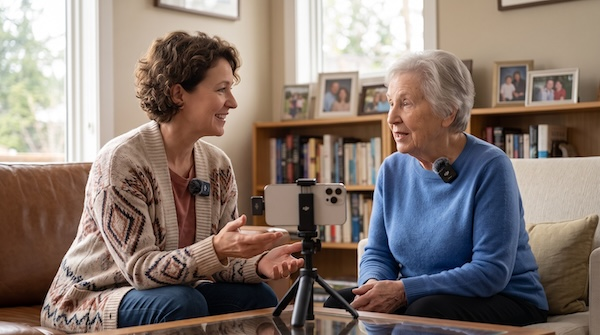

 
# Step-by-Step Practical Tips for Audio Recording an Interview with an Elder

1 - Pre-Interview and Environment
{: .label .label-step}
* **Pick a soft, quiet room.** Choose a space with carpets, curtains, and upholstered furniture to absorb room echo, rather than kitchens or dining areas with hard, reflective surfaces.
* **Eliminate subtle background noise.** Turn off television sets, air conditioners, fans, and chiming clocks, as low hums prove difficult to remove cleanly in post-production without degrading voice timbre.
* **Keep sessions under 45 to 60 minutes.** Energy and vocal clarity decline quickly; scheduling two or three shorter conversations produces far better material than a single marathon session.
{: .step}

2 - Equipment and Setup
{: .label .label-step} 
* **Set up a secondary backup recorder.** Run a voice memo app on a second smartphone placed on a soft cloth or coaster nearby as a fail-safe against corrupted files or dead batteries.
* **Keep gear visually unobtrusive.** Large microphones and heavy headphones can feel intimidating or clinical, so tuck receivers and wires out of sight to keep the atmosphere conversational.
{: .step}

3 - During the Conversation
{: .label .label-step}
* **Practice silent active listening.** Nod, maintain eye contact, and use facial expressions instead of verbal interjections like "uh-huh" or "yeah," which bleed over their audio and ruin potential soundbites.
* **Embrace deliberate pauses.** Allow 3 to 5 seconds of silence after they appear to finish a thought, as older adults often use that quiet space to retrieve deeper, more detailed memories.
* **Have water within easy reach.** Dry mouth and vocal fatigue occur rapidly; offering room-temperature water keeps speech clear and reduces mouth clicks.
* **Anchor memories with physical prompts.** Bring family photographs, letters, or familiar keepsakes to ground abstract questions in concrete sensory details and stories.
{: .step}

[NEXT STEP: Earn a Workshop Badge](informal-credentials.html){: .btn .btn-blue }
