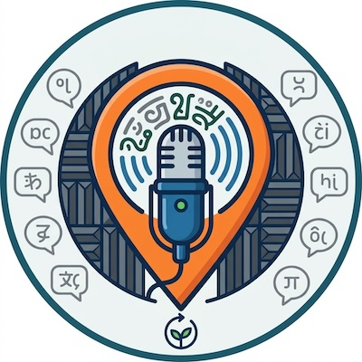

# Audio Recording for Language Revitalization

- Pre-workshop activities: 10 min 
- Introductory presentation: 10 min
- Hands-on activities: 50-80+ min

High quality audio recording makes a huge difference in the quality and usability of language learning games as well as recording with Elders and Knowledge Keepers.

Recording with a microphone like the DJI Mic Mini, instead of your phone’s built-in microphone, keeps the speaker’s distance from the microphone constant for every letter, so all of your audio files come out at a similar volume with far less room echo. This matters most when you are recording with Elders and language keepers, where you may only get one session.

## Learning objectives

At the end of this workshop, you will be able to:

1. **Location Selection for Recording**: Describe the importance of using a quiet location with "soft" surfaces like carpeting and curtains to minimize room echo, sound reflections, and ambient noise when recording high-quality audio.
2. **Optimal Microphone Placement**: Position the microphone correctly on a speaker, about 15 to 20 cm below the chin, and decide when a windscreen or noise cancelling is warranted and when it will do more harm than good.
3. **Live Audio Level Monitoring & Volume Settings on Location**: With your interviewee speaking, use software level meters in the DJI Mimo app and physical gain (or volume) dial on the receiver to set optimal recording levels, to prevent audio distortion.
5. **On Site Playback Test**: Run a short playback test, including the scratch test on the transmitter capsule, to verify that the external microphone rather than the phone's built-in mic is actually recording.
6. **Web-Friendly Naming Conventions**: Apply standard file-naming practices (lowercase, plain text, replacing diacritics and special characters with web-safe notation like c_glottal) to prepare audio assets for software integration.
7. **Audio Trimming & Editing**: Trim each recording in Voice Memos so only a sliver of silence remains before and after the letter, and explain how that trimming makes a soundboard feel responsive to the touch.
8. **Asset Export & File Management**: Export, transfer, and organize recorded .m4a audio assets across cloud storage platforms or devices (e.g., AirDrop, iCloud, Google Drive).
9. **Audio Troubleshooting & Problem Solving**: Be aware of how to resolve common technical recording issues, including mic selection errors, clipping distortion, low gain, and ambient background noise.
10. **Ethical Audio Protocols & Language Documentation**: Describe the permissions and protocols involved in recording with Elders and language keepers, including asking permission, confirming who the audio can be shared with, verifying spellings and pronunciations, and archiving untrimmed originals.
11. **Record an Interview**: Record a short interview with someone in the workshop, using the best practices outlined in the workshop.
 
[NEXT STEP: Pre-Workshop Activities](pre-workshop.html){: .btn .btn-blue }
